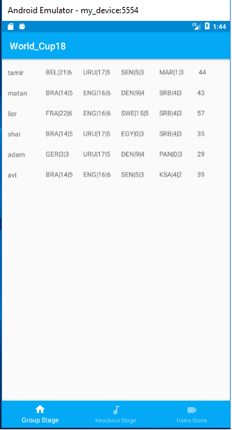
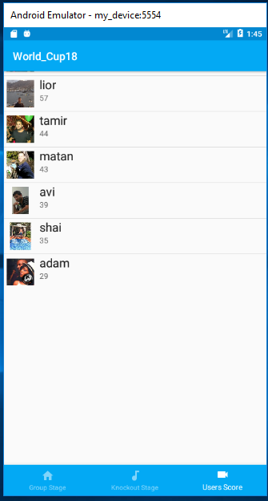

# # WorldCup bet platfrom for friend 
project was created to improve my ability of android development using xamarin native. 
project was created after wc18 start (made in rush)then the use for this app is only to sum the points,so hopefully all the process (registration, selection of teams and more) will be ready in euro2020 :). 
main features: 
downloading json file with the data,then convert it to objects using [quicktype.io](https://quicktype.io/) 
 and then working with android components and css to show the processed data . 
 game rules: 
all teams were divided into 4 categories,each player choose 1 team from each category. 
win 3 points,draw 1 point,loss 0. 
If a team in a low category wins a team with a higher ranking 1 bonus point. 
each stage the team pass ,credited player 2 bonus points(advance from group stage 2 points and goes on...) 
 

